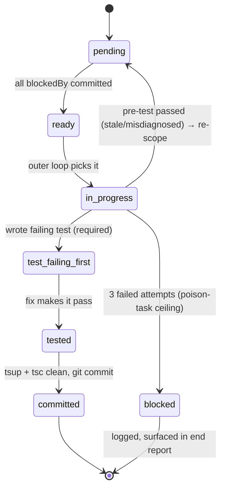
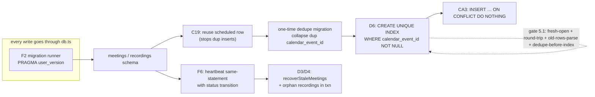

# MiBot — Autonomous Build Harness (`build-loop.md`)

> Builds **both** `hardening-spec.md` and `architecture-spec.md` to completion with no
> hand-holding. This file is the contract for `/loop tasks/build-loop.md` (Phase 4).
> It defines: the loops (trigger / one iteration / exit), the gates, the task DAG with
> its sequencing constraints, the per-task lifecycle, the DB critical-path gate, the
> compound stop condition, and the three-artifact insight discipline.
>
> **Invariants that never bend:**
> - Never mark a task done on red (its own test failing, or the full suite failing).
> - Every fix ships with a regression test that **FAILS before, PASSES after**.
> - Silent-failure bugs are this codebase's signature — a fix that can't be proven with a
>   test that first fails is not done; log it to `opportunities.md`, don't fake-complete it.
> - Work on a branch, never `main`. One commit per completed task.

---

## 0. Ground rules

- **Stack commands:** build `npx tsup` · typecheck `npx tsc --noEmit` · test `npx vitest run`.
- **Branch:** `git checkout -b harden/build-loop` at start. All commits land here.
- **Commit message format:** `<taskId> <severity> <one-line>` e.g. `M1 P0 fix frozen consecutiveEmptyPolls`.
- **Source of truth for tasks:** the DAG in §6 + the checkboxes in `tasks/todo.md`. They
  are the resume mechanism (§5.3).
- **Refactors before their dependents.** A finding tagged `→ Rn`/`→ Fn` is not started
  until its refactor node is `committed`.
- **Priority within ready tasks:** P0 → foundation refactor (F/R/AR) → P1 → P2 → P3.
  Ties broken by lowest DAG depth.

---

## 1. Inner loop — implement ONE task

**Trigger:** the outer loop hands a `ready` task.

**One iteration:**
1. **Read** the task's spec entry (hardening or architecture) + the exact `file:line`.
   Re-read the code — the spec's line numbers may have drifted from earlier commits.
2. **Write the regression test first.** Add/extend a `test/*.test.ts` that reproduces the
   failure. **Run it — it MUST fail** (`npx vitest run <file>`). If it passes already, the
   bug is stale or misdiagnosed → log to `lessons.md` (misdiagnosis pattern), re-check the
   spec, either re-scope or mark the finding obsolete. Do not proceed on a green pre-test.
3. **Implement the fix.** Smallest change that satisfies the spec entry + its refactor.
   Honor the sequencing notes in the spec (e.g. M1+M3 feed aria-count into the leave gate).
4. **Run the new test — it MUST pass.** Then run the task's *sibling* tests (same file).
5. **Self-review** ("would a staff engineer approve?"): no swallowed errors, no new module
   singletons (AR3), status transitions go through `status.ts` (AR2), external calls go
   through `runCli` (AR4). If it feels hacky → re-plan (§4), don't ship the hack.
6. **Build + typecheck:** `npx tsup && npx tsc --noEmit`. Both must be clean.
7. **Commit** with the standard message. Mark the task `tested → committed` (§3).

**Exit:** task committed green, or escalated to the poison-task path (§5.2) after 3 fails.

---

## 2. Outer loop — walk the DAG

**Trigger:** inner loop finished a task, or build start.

**One iteration:**
1. `TaskList` / read `todo.md`. Recompute `ready` = `pending` ∧ all `blockedBy` are
   `committed`.
2. If no `ready` tasks and none `in_progress` → go to the stop-condition check (§7).
3. Pick the highest-priority ready task (§0 ordering). Mark `in_progress`.
4. Run the inner loop (§1) on it.
5. On success: mark `committed`, re-evaluate readiness (this may unblock dependents).
6. **Tier boundary?** If this task was the last of a P-tier *or* every N=8 tasks, run the
   full-suite loop (§ Full-suite) then the smoke loop (§ Smoke) before continuing.

---

## 3. Per-task lifecycle state machine



A task may only reach `committed` through `test_failing_first → tested` — there is no path
that commits a fix without a test that first failed.

---

## 4. Re-plan loop (justified addition)

**Trigger:** a task fails its build/typecheck twice, OR reality diverges from the spec
(the `file:line` moved, a dependency was wrong, a fix touches more than its blast radius).

**One iteration:** stop the inner loop; write the divergence to `lessons.md` (mistake →
rule); update the DAG/`todo.md` (add edges, split the task, or re-scope); resume the outer
loop. Prevents thrashing on a task whose plan is wrong rather than whose code is wrong.

---

## 5. Gates & special handling

### 5.1 DB / schema critical-path gate
Any task touching `db.ts` schema or a migration (**F2 migration-runner, C19, D6, D4, D7,
D9**) must additionally prove, in its test:
- The DB **opens clean** on a fresh file (migrations run to `PRAGMA user_version = N`).
- A **round-trip** insert → read succeeds for the changed table.
- **Existing rows still parse** — seed a DB at the *previous* `user_version`, run the
  migration, assert old rows survive and the new constraint/column holds.
- For **D6 specifically:** seed a DB containing *duplicate* `calendar_event_id` rows
  (the pre-C19 state), assert the dedupe migration collapses them **before**
  `CREATE UNIQUE INDEX`, and that the index then creates without error.

This gate exists because everything persists through `db.ts`; a wrong migration builds the
rest on sand. A schema task cannot reach `committed` without all four proofs green.

### 5.2 Poison-task ceiling
After **3** failed inner-loop attempts on one task: mark it `blocked`, append the failure
reason + last error to `lessons.md`, **continue the rest of the DAG**, and list it in the
end report. Autonomous execution TERMINATES with a report — it never spins forever on one
task.

### 5.3 Resumability (idempotency)
The DAG + `todo.md` checkboxes + per-task commits ARE the resume mechanism. Re-running
`/loop tasks/build-loop.md` is idempotent: it recomputes `ready` from checkbox state, skips
`committed`, retries `pending`/`in_progress`, and leaves `blocked` for human triage. No
task is committed without its commit landing, so a crash mid-task loses at most the
uncommitted working tree, which the next run re-derives from the still-`pending` checkbox.

---

## 6. Task DAG

Nodes = spec items (foundation refactors `F*`, then findings). Edges = "must be committed
before". Grouped by wave; **waves are priority bands, not hard barriers** — the outer loop
pulls any ready task, and P0s inside later waves (AU1) surface as soon as their foundation
(F-audio) is ready.

```mermaid
graph TD
    subgraph W0["Wave 0 — Foundations (unblock everything)"]
        F1["F1: status.ts state machine<br/>(AR2 + OQ3 enum incl. no_audio)"]
        F2["F2: migration runner<br/>(AD6 / AQ3, PRAGMA user_version)"]
        F3["F3: config validate + thread<br/>(R10 / AR8)"]
        F4["F4: runCli boundary<br/>(R7 / AR4)"]
        F5["F5: LeavePolicy pure fn<br/>(AD4 / AQ2)"]
        F6["F6: heartbeat-as-liveness<br/>(R1 / AR6, both backends)"]
        F7["F7: findElement deadline-poll<br/>(R9)"]
        F8["F8: Camofox api() validation<br/>(R8)"]
        F9["F9: signal dedup util<br/>(R11)"]
    end

    subgraph W1["Wave 1 — Data integrity"]
        C19["C19 P1: dup-row rejoin loop<br/>(bot.ts:50)"]
        D6["D6 P2: UNIQUE index + dedupe"]
        CA3["CA3 P2: race dedup → ON CONFLICT"]
        CA4["CA4 P2: cross-provider dedup"]
        D3["D3 P1: stale-heartbeat kill"]
        D4["D4 P2: orphan recordings row"]
        D5["D5 P2: tz validation"]
        D7["D7 P3: missed-meeting sweep"]
        D8["D8 P3: changes===0 warn"]
        D9["D9 P3: closeDb on exit"]
    end

    subgraph W2["Wave 2 — Transcription + Calendar"]
        R6["R6: transcribe outcome enum"]
        T1["T1 P1: failed→done overwrite"]
        T2["T2 P1: exit-0 no-output"]
        C5["C5 P1: camofox never transcribes"]
        C7["C7 P2: catch clobbers terminal status"]
        T3["T3 P1: --db abs path"]
        Trest["T4-T8 P2/P3 (via F4)"]
        AR7["AR7: calendar ingest seam"]
        CA1["CA1 P1: exit-1 stdout-as-success"]
        CA2["CA2 P1: no update/cancel"]
        CArest["CA5,CA6,CA8,CA9,CA10,CA11 (via AR7/F4)"]
    end

    subgraph W3["Wave 3 — Meeting lifecycle"]
        M1["M1 P0: frozen consecutiveEmptyPolls"]
        M3["M3 P1: fabricated participant names"]
        M15["M15 P1: camofox no alone-detection"]
        M9["M9 P2: minHumans>0 alone gate"]
        M7["M7 P2: leave-button debounce"]
        M2["M2 P1: waitForTimeout reject"]
        M6["M6 P2: first-60s skips loop body"]
        M8["M8 P2: mkdir outside try"]
        M4["M4 P1: chat DOM-index dedup"]
        M5["M5 P1: hand-as-reaction spam"]
        M10["M10 P2: hand re-raise overwrite"]
        Mrest["M11,M12,M13,M14,M16 P2/P3"]
    end

    subgraph W4["Wave 4 — Audio lifecycle (ONE PR, OQ1: R4→R3→R2)"]
        FA["F-audio: AR5/R4 hook source"]
        R3["R3: managed ffmpeg wrapper"]
        R2["R2: per-bot capture sessions (AR3)"]
        AU1["AU1 P0: Zoom no WebRTC audio"]
        DRAIN["AU3/AU8/AU12 drain protocol (OQ5)"]
        AU10["AU10 P2: overwrite longer capture"]
        AUrest["AU2,AU4-7,AU11,AU13,AU14"]
    end

    subgraph W5["Wave 5 — Join hardening + CLI edges"]
        Jr["J* via F7/F8 (R9/R8) + J5,J7,J17-J24"]
        R13["R13: control-socket edges + single exit"]
        C1["C1 P1: signal handler no exit"]
        C2["C2 P1: no socket error handler"]
        C3["C3 P1: heartbeat not in finally"]
        C4["C4 P1: cross-bot ffmpeg kill"]
        C6["C6 P1: heartbeat accounting"]
        Cr["C8-C18,C20 P2/P3"]
    end

    subgraph W6["Wave 6 — Structural unification (LAST, optional-in-scope)"]
        AR1["AR1: BrowserBackend + unified pipeline<br/>(AD1,AD2,AD3,AD5,AD8,AD9)"]
    end

    F2 --> C19 --> D6 --> CA3 --> CA4
    F2 --> D4
    F2 --> D7
    F2 --> D9
    F6 --> D3
    F6 --> D4
    F6 --> C6
    F3 --> D5
    F1 --> R6 --> T1
    R6 --> T2
    R6 --> C5
    R6 --> C7
    F4 --> Trest
    F4 --> AR7 --> CA1
    AR7 --> CA2
    AR7 --> CArest
    F4 --> T3
    F5 --> M1
    F5 --> M3
    M1 --> M3
    F5 --> M15
    F5 --> M9
    F5 --> M7
    F9 --> M4
    F9 --> M5
    F9 --> M10
    F6 --> M15
    FA --> R3 --> R2
    FA --> AU1
    FA --> DRAIN
    R2 --> AU10
    F7 --> Jr
    F8 --> Jr
    R13 --> C1
    R13 --> C2
    F1 --> C7
    AR1 -.subsumes.-> M15
    AR1 -.subsumes.-> C5
    AR1 -.needs.-> F5
    AR1 -.needs.-> R2
    AR1 -.needs.-> F1
```



### Hard sequencing edges (from both specs — violating these breaks live systems)
1. **F2 → C19 → D6 → CA3 → CA4.** Migration runner, then stop duplicate inserts, then the
   UNIQUE index (with dedupe migration), then the dedup fixes that rely on it.
2. **M1 and M3 are ONE task** (`M1+M3`) — combined naively they invert M1 into leaving an
   active meeting. M3 feeds `aria-count − self` into the leave gate.
3. **F1 (status enum incl. `no_audio`) → R6 → {T1, T2, C5, C7}.**
4. **F6 (heartbeat) covers BOTH backends** — C5 adds a camofox `processing` phase that
   needs a heartbeat, so F6 lands before/with C5.
5. **F-audio (R4) → R3 → R2**, as one coordinated audio PR (OQ1). AU1 (P0) rides on R4.
6. **R3 + C13 land with/before C1** — the single graceful signal-exit path awaits ffmpeg
   stop + log flush.
7. **AR1 is last** and needs F5, R2, F1 already committed; it is optional-within-scope
   (its target bugs M15/C5 are already fixed tactically by wave 3/2).

---

## 7. DB-schema impact map (critical path)



Any node in this chain triggers the §5.1 critical-path gate. The `IDX` node additionally
requires the seeded-duplicates proof.

---

## 8. Loops that run at tier boundaries

### Full-suite regression loop
**Trigger:** end of a P-tier, or every 8 committed tasks.
**Iteration:** `npx vitest run` (entire suite, not just new tests) + `npx tsup` +
`npx tsc --noEmit`. Any red → stop, identify which committed task broke it, re-plan (§4),
log to `lessons.md`. This is what catches fix #40 breaking fix #12.
**Exit:** full suite green.

### Smoke / integration loop
**Trigger:** once per tier (silent-failure bugs don't show in unit tests).
**Iteration** — exercise the real thing against `dist/`:
- `node dist/index.js config` — prints validated config, exits 0.
- `node dist/index.js meetings` and `... recordings` — no "Invalid Date" (R12), no crash
  on empty/edge rows.
- Boot a control channel and run one command end-to-end (`ok:false` → exit 1, per C9).
- Dry-run one playbook parse per platform (`teams/zoom/meet`) — load + schema-validate
  (R10) without launching a browser.
- After F-audio: assert `flushAudioToDisk` returns non-empty for an iframe RTCPeerConnection
  fixture (the AU1 P0 smoke — the exact silent-failure class units miss).
**Exit:** all smoke checks pass; any failure is a `blocked` task + report entry.

---

## 9. Compound stop condition (ALL must hold)

```
DONE = every DAG node committed (or explicitly blocked-and-logged)
       AND `npx vitest run` fully green (whole suite)
       AND `npx tsup` builds AND `npx tsc --noEmit` clean
       AND `node dist/index.js config|meetings|recordings` boot clean (smoke §8)
       AND both specs have no unaddressed item (every finding → committed or blocked)
```

Per-task green is **not** sufficient — the final full-suite + smoke gate is the real
finish line. On any blocked/failing task at the end: stop, emit the report, never claim
done on red.

---

## 10. Insight discipline — exactly three artifacts (log to files, don't narrate)

- **`tasks/lessons.md`** — mistake → rule. Appended **only** on a correction or failure
  (a stale finding, a re-plan, a broken-by-later-fix). It must compound across runs.
- **`tasks/opportunities.md`** — the deferred-work sink. During the build:
  - A newly-found **optimization** → one line, **not acted on** (no failing test → acting
    would violate the verification bar).
  - A newly-found **bug** → captured as a candidate task with proposed severity, **never**
    silently fixed outside the DAG.
  - Sole exception: a fix impossible without a minimal refactor may include that refactor
    (as an `Rn` anticipates). This file is the curated input to the *next* loop.
- **End-of-run report** — built / deferred / blocked / final test + smoke status. Emitted
  once, when §9 is evaluated.

---

## 11. Task DAG → `tasks/todo.md`
The full node list with checkboxes lives in `tasks/todo.md`, grouped by wave and annotated
with `blockedBy`. That file + the commit trail are the resumable state. Keep it current:
check a box only when its task reaches `committed`.
